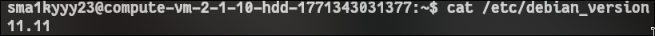
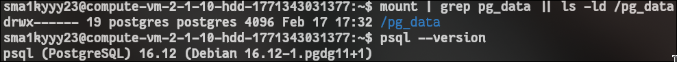
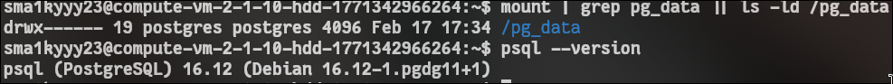

<!-- выполнение задачи 0 -->

## ТЗ:

Поднять 2 виртуалки. Воткнуть дополнительный диск в вашу виртуалку (но можно просто выделить партицию на текущем диске) в качестве отдельного диска под данные базы.

## описание:

Я арендовал 2 виртуалки на YandexCloud. 
<!-- здесь зафиксированы параметры арендованных виртуальных машин -->
- vm1: `158.160.30.82`, debian 11, 2 vcpu, 1 gb ram, 10 gb hdd
- vm2: `89.169.182.136`, debian 11, 2 vcpu, 1 gb ram, 10 gb hdd

## 1 базовая подготовка обеих машин

```bash
# обновляем индекс пакетов
sudo apt update

# устанавливаем базовые утилиты
sudo apt install -y gnupg2 curl ca-certificates lsb-release sudo vim

# сверяем версию системы
cat /etc/debian_version
```
## скрины сверок 
1 ВМ

2 ВМ


## 2 подключение официального репозитория postgresql

<!-- этот блок выполняется на каждой vm одинаково -->
```bash
# добавляем ключ репозитория postgresql
curl -fsSL https://www.postgresql.org/media/keys/ACCC4CF8.asc \
  | sudo gpg --dearmor -o /usr/share/keyrings/postgresql.gpg

# добавляем репозиторий pgdg для debian 11 bullseye
sudo sh -c 'echo "deb [signed-by=/usr/share/keyrings/postgresql.gpg] http://apt.postgresql.org/pub/repos/apt bullseye-pgdg main" > /etc/apt/sources.list.d/pgdg.list'

# обновляем индекс пакетов после добавления репозитория
sudo apt update
```

## 3 подготовка диска под `/pg_data`

здесь два варианта: отдельный диск или раздел внутри текущего диска

у меня на ВМ нет отдельного диска и это плохо. почему? банально, если бдшка разрастется и забьет всю память, то ОС просто грокнется, так как / не хватит места для временных файлов. я не рассматриваю вариант добавления еще одного диска, так как арендую ВМ и принимаю свои риски (тот кто это читает, решай сам)

### вариант, если нет отдельного диска:

```bash
# для начала просто создадим каталог на текущем диске, ведь мы еще не установили постгря и у нас нет пользователя 
sudo mkdir -p /pg_data

#установка postgresql 16 на vm1 и vm2

# устанавливаем сервер и клиент postgresql 16
sudo apt install -y postgresql-16 postgresql-client-16 postgresql-contrib-16 # мб апт не увидит пакетов постгря16 т.к их может не быть в репо,в таком случае прсото подлкючите официальный репо постгря и все будет норм

# проверяем наличие initdb
/usr/lib/postgresql/16/bin/initdb --version

# теперь уже задаем владельца и базовые права
sudo chown postgres:postgres /pg_data
sudo chmod 700 /pg_data

# останавливаем автосозданный кластер, чтобы в следующей задаче инициализировать вручную
sudo systemctl stop postgresql
sudo pg_dropcluster --stop 13 main || true

# убеждаемся, что кластер удален
pg_lsclusters
```

## 4 проверка готовности к следующим задачам

#проверка, что условия задачи выполнены
```bash
# проверяем, что точка монтирования существует
mount | grep pg_data || ls -ld /pg_data

# проверяем установленную версию postgresql
psql --version
```

## результат задачи 0
1 ВМ


2 ВМ


- обе vm подготовлены на debian 11 с одинаковым набором пакетов
- репозиторий postgresql добавлен
- путь `/pg_data` создан и готов для хранения данных
- postgresql 16 установлен, автокластер удален, можно переходить к ручной инициализации в следующих задачах


