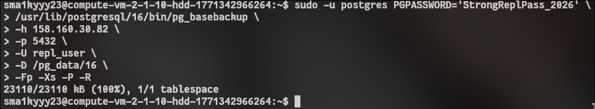
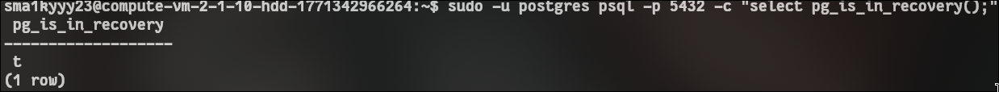
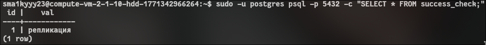

<!-- выполнение задачи 2 на второй виртуальной машине для физической репликации -->

## ТЗ: 

установить postgresql
- Руками проинициализировать инстанс БД с данными в папке /pg_data/16/

- На второй виртуалке (физическая репликация)
    1. Сделать Дамп базы из 1 виртуалки (`pg_basebackup`)
    2. Настроить репликацию на этом сервере

## 1 ansible

## сначала выполняем подготовительный playbook для replica хоста
```bash
# запускаем ansible playbook для второй vml
ansible-playbook -i inventory.ini main.yaml \
  --user debian \
  --private-key ~/.ssh/id_ed25519
```

## 2 создание базы со второй vm

## команда запускается на replica сервере
```bash
# останавливаем postgresql если он запущен
sudo systemctl stop postgresql || true

# очищаем старый каталог данных
sudo rm -rf /pg_data/16
sudo mkdir -p /pg_data/16
sudo chown postgres:postgres /pg_data/16
sudo chmod 700 /pg_data/16

# выполняем копию кластера с primary и сразу пишем параметры восстановления
sudo -u postgres PGPASSWORD='StrongReplPass_2026' \
  /usr/lib/postgresql/16/bin/pg_basebackup \
  -h 158.160.30.82 \
  -p 5432 \
  -U repl_user \
  -D /pg_data/16 \
  -Fp -Xs -P -R
```

скрин выполнения 


## 3 запуск standby

# после pg_basebackup запускаем сервер как реплику
```bash
# стартуем инстанс из каталога реплики
sudo -u postgres /usr/lib/postgresql/16/bin/pg_ctl -D /pg_data/16 -l /var/log/postgresql/postgresql-16-replica.log start
```

# 4 проверки репликации

# сначала проверяем на replica
```sql
-- replica должна вернуть true
select pg_is_in_recovery();
```

# затем проверяем на primary
```sql
-- на primary должен быть виден wal receiver второй vm
select client_addr, state, sync_state
from pg_stat_replication;
```

скрины:

на реплике:


на мастере:


реплика успешно подключена
но давайте деатльнее посмотри на работу синхронизации

на мастере создаем таблицу 

```bash
sudo -u postgres psql -c "CREATE TABLE success_check (id serial, val text); INSERT INTO success_check (val) VALUES ('репликация');"
```

на реплике смотрим результат

```bash
sudo -u postgres psql -p 5432 -c "SELECT * FROM success_check;"
```
реузьлтат:



### итоги епт

пойдет

- на второй vm создан физический клон primary через `pg_basebackup`
- standby запущен из `/pg_data/16`
- `pg_is_in_recovery()` возвращает `true`
- на primary есть активная запись о реплике в `pg_stat_replication`