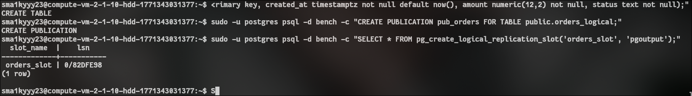
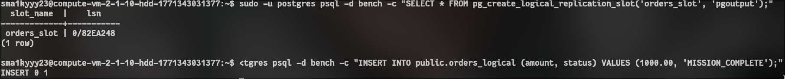
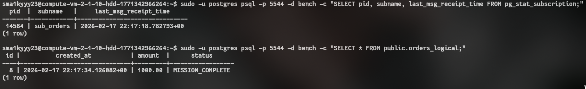

<!-- выполнение задачи 3 по логической репликации отдельной таблицы -->

## ТЗ 
- (логическая репликация)
    1. поднять еще один инстанс БД на второй виртуалке с данными в /pg_data/16-one-base/
    1. Поднять слот логической репликации на мастере только для одной таблицы
    2. Подключиться к слоту логической репликации на второй виртуалке

## 1 подготовка второго инстанса на replica

## подготовка делается playbook, запуск вручную
```bash
# запускаем playbook для второго логического инстанса
ansible-playbook -i inventory.ini main.yaml
```

## 2. действия на primary

## команды выполняются на первой вм
```sql
-- создаем отдельную таблицу для логической репликации
create table if not exists public.orders_logical (
    id bigserial primary key,
    created_at timestamptz not null default now(),
    amount numeric(12,2) not null,
    status text not null
);

-- создаем публикацию только для этой таблицы
create publication pub_orders for table public.orders_logical;

-- создаем слот логической репликации
select * from pg_create_logical_replication_slot('orders_slot', 'pgoutput');
```
скрин:


## 3 действия на втором инстансе replica vm

## подключаемся к порту второго инстанса, например 5544
```sql
-- создаем принимающую таблицу той же структуры
create table if not exists public.orders_logical (
    id bigserial primary key,
    created_at timestamptz not null,
    amount numeric(12,2) not null,
    status text not null
);

-- создаем подписку к primary на одну таблицу
create subscription sub_orders
connection 'host=158.160.30.82 port=5432 dbname=bench user=repl_user password=StrongReplPass_2026'
publication pub_orders
with (copy_data = true, create_slot = false, slot_name = 'orders_slot');
```

## 4 проверка передачи данных

## вставка на primary
```sql
insert into public.orders_logical (amount, status)
values (1200.50, 'new'), (999.99, 'paid');
```

## проверка на втором инстансе
```sql
select id, amount, status, created_at
from public.orders_logical
order by id desc
limit 10;
```
проверка на мастере


проверка на реплике 


## итоги епт

- отдельный инстанс на второй vm поднят в `/pg_data/16-one-base`
- на primary есть публикация `pub_orders` только для таблицы `orders_logical`
- слот `orders_slot` создан
- подписка `sub_orders` подключена ко второму инстансу
- новые записи из primary приходят на второй инстанс
