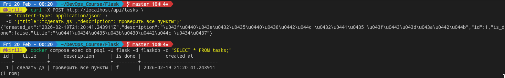
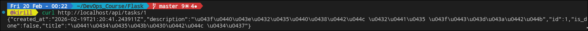
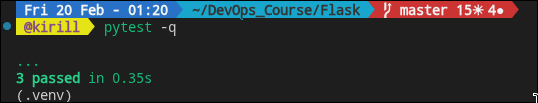

<!-- CRUD на Flask -->

# Django когда-нибудь потом, ес ср.

## ТЗ

- Написать CRUD приложение на Flask  (если вдруг кто умеет на Django тоже можно)
- Что это значит
1. У вас должна быть поднята база данных (postgres) с данными внутри
2. Приложение должно уметь выполнять CRUD операции над этими данными
3. Приложение должно запускаться через uwsgi/gunicorn
4. Над приложением должен быть nginx который проксирует запросы пользоватлей в ваш back
5. Настроить кеширование запросов на стороне:
• nginx
• redis
Все должно запускаться в docker
—— Кому мало
1. Настроить кеширование запросов с nginx в redis

Пример и дока тут:
1. https://github.com/bob4inski/admin-starterpack/tree/main/full-course/week-2/mini-flask

## источники для работы

в первую очередь гит роберто с мини примером
-  https://github.com/bob4inski/admin-starterpack/tree/main/full-course/week-2/mini-flask
  далее уже 
- официальный flask patterns https://flask.palletsprojects.com/en/stable/patterns/ (application factory, blueprints)
- официальный sqlalchemy + flask-sqlalchemy подход https://flask.palletsprojects.com/en/stable/patterns/sqlalchemy/ и https://flask-russian-docs.readthedocs.io/ru/0.10.1/patterns/sqlalchemy.html
- официальный gunicorn deployment flow https://reharish.medium.com/deploying-flask-using-gunicorn-b0c0e8a58e07 и https://flask.palletsprojects.com/en/stable/deploying/gunicorn/

---

## архитектура

```text
чел -> nginx:80 -> gunicorn(flask app):8000 -> постгря
                          |
                          -> redis (кеш /api/tasks)
```
## почему так (для тех, кто не был на паре и в целом не знает базы, по типу вида кеширования nginx, архитектуры rest/soap и прочее)
- flask app отделен от infra, ну просто для удосбтва
- gunicorn нужен как wsgi сервер, он отлично работает в связке с nginx
- nginx отвечает за входящий трафик и micro-cache
- redis хранит кеш ответа списка задач на уровне приложения
- ну и compose для поднятия всего одной командой

# я решил реализовать дерево проекта так:

```text
  @kirill  tree -h
[4.0K]  .
├── [4.0K]  app
│   ├── [1.2K]  cache.py
│   ├── [ 782]  config.py
│   ├── [ 183]  extensions.py
│   ├── [ 662]  __init__.py
│   ├── [ 894]  models.py
│   └── [2.9K]  routes.py
├── [2.1K]  docker-compose.yaml
├── [ 510]  Dockerfile
├── [4.0K]  nginx
│   └── [1.3K]  default.conf
├── [7.8K]  README.md
├── [ 293]  requiremenets.txt
├── [4.0K]  screens
│   ├── [ 39K]  image-1.png
│   ├── [ 46K]  image-2.png
│   ├── [ 19K]  image-3.png
│   ├── [ 23K]  image-4.png
│   ├── [ 11K]  image-5.png
│   ├── [ 12K]  image-6.png
│   └── [ 11K]  image.png
├── [4.0K]  tests
│   ├── [1.6K]  conftest.py
│   └── [2.1K]  test_tasks_api.py
└── [  92]  wsgi.py

5 directories, 21 files
```

## океееей, леттс гооо

# 1 папка проекта

```bash
cd Flask
```

должны быть здесь

# 2 поднятие всего стенда

```bash
docker compose up --build -d
```

сразу говорю, сейчас DockerHub банят, поэтому при сборке Docker не сможет достучаться до него и вот как это можно пофиксить (так сделал я)
открываете файл `sudo nano /etc/docker/daemon.json`
и вставляете 
```bash
{
  "registry-mirrors": [
    "https://mirror.gcr.io",
    "https://daocloud.io",
    "https://c.163.com"
  ]
}
```
после сохранения перезапустите докер `sudo systemctl restart docker`

# 3 проверка здоровья у нашего братика 

``` bash
curl http://localhost/api/health
```

ожидаемый ответ в виде статуса: ок

скринчик:

---

## CRUD поинты

# создаю задачу

```bash
curl -X POST http://localhost/api/tasks \
  -H 'Content-Type: application/json' \
  -d '{"title":"сделать дз","description":"проверить все пункты"}'
```
скринчик:


# получить список задач 

```bash
curl http://localhost/api/tasks
```
# в ответе будет source и тут надо различать, если будет postgres - список прочитался из бд, если будет redis-cache - список пришел из redis

скринчик:


# что и ожидалось, первый запрос идет с базки, при последующих приходит с редиска

# получаем задачу id

```bash
curl http://localhost/api/tasks/1
```
скринчик:


# обновить задачу

```bash
curl -X  PUT http://localhost/api/tasks/1 \
  -H 'Content-Type: application/json' \
  -d '{"title": "flask task", "is done": "true"}'
```
скринчик:


# удалить задачу 

```bash
curl -X DELETE http://localhost/api/tasks/1
```
скринчик:


---

## как работает кеш

- поинт на '/api/tasks' сначала смотрит ключ 'tasks:list' в redis 
- если ключа нет, читаем postgres, перебираем и кладем в redis с ttl 
- при add/update/delete кеш инвалидируется 

# nginx кеш 

- в `nginx/default.conf` включен `proxy_cache`
- кешируетмя только `GET/HEAD`
- в ответ добавляется `X-Nginx-Cache: HIT|MISS|BYPASS` 
- 
---

## тестирование

локально:

```bash
python3 -m venv .venv
source .venv/bin/activate
pip install -r requiremenets.txt
pytest -q
```
скринчик:


---

### почему у `source` иногда всегда `postgres`
- поле `source` показывает источник данных внутри flask приложения в момент, когда ответ был сгенерен
- если nginx отдал кешированный ответ (HIT), то старое значение значение `source` из кешированного body
- чтобы наглядно увидеть redis-cache из приложения, endpoint `/api/tasks` исключен из nginx-cache и всегда проксируется в app

проверка:

```bash
curl -i http://localhost/api/tasks
curl -i http://localhost/api/tasks
```

ожидаемо:
- 1-й запрос: `source=postgres`
- 2-й запрос: `source=redis-cache`
- заголовок: `X-Nginx-Cache-Status: BYPASS`
  
  скринчик: 
  
---

# итоги епт

- постгря поднят и используется приложением
- реализован CRUD на Flask
- запуск через gunicorn 
- nginx проксируется на бэк
- кеширование на nginx есть
- кеширование на redis есть 
- все в композе под автоматизацию запуска

## пункт "nginx -> redis cache" "кому мало" это доп задача и обычно требует стороннего nginx-модуля. я реализовал базовый стек: nginx micro-cache + redis app-cache

### тимати ван лав