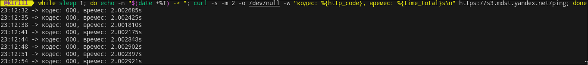

Задача 0. 

ТЗ: Написать однострочник который раз в секунд дергает https://s3.mdst.yandex.net/ping и выводит код ответа, timestamp и время запроса.

Использовался цикл while и утилита curl.

Скрины работоспособности сркипта: 

Результат 000, потому что s3.mdst.yandex.net данный домен яндекса внутренний ресурс, поэтому запрос не может достучаться. 
Пример с другим URL (https://ya.ru), в котором добавил -L, чтобы автоматически проходить все 301 и 302 (см. файл BashCode.sh):

Инструкция:

Копируете и вставляете в терминал однострочник.
Для остановки Ctrl + C.

