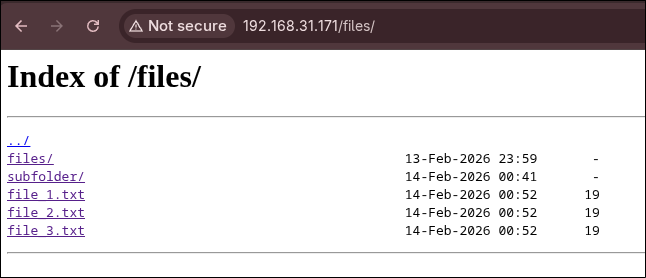

Задача 1. 

ТЗ: Раздача статичных файлов через nginx.
Задание: вы должны установить nginx на виртуалку/на свой хост и написать такую конфигурацию, чтобы при открытии по ручке /files вы могли видеть все файлики. 
Целевая картинка: вы можете открыть вебку nginx и увидеть какое-то количество файликов к примеру как в https://mirror.yandex.ru/debian/tools/

Использовался ansible инструмент автоматизации для настройки сервера, модуль ansible.builtin.package для автоматической установки nginx, модуль ansible.builtin.template для создания конфиг файла nginx и шаблона templates/nginx.conf.j2, модуль ansible.builtin.file для создания папок и прав доступа, модуль ansible.builtin.copy для создания тестовых файлов, handlers или же обработчики для автоматической проверки конфига и перезапуска nginx.

Скрины работоспособности:

Главная страница 

Переход по ручке /files/ на файловый центр

Инструкция:

Убедитесь, что установлен ansible.

Запуск плейбука:
ansible-playbook -i inventory.ini main.yaml

